<div align="center">

```
███████╗██╗   ██╗██████╗ ██╗   ██╗██╗██╗   ██╗ █████╗ ██╗     ██╗███████╗████████╗
██╔════╝██║   ██║██╔══██╗██║   ██║██║██║   ██║██╔══██╗██║     ██║██╔════╝╚══██╔══╝
███████╗██║   ██║██████╔╝██║   ██║██║██║   ██║███████║██║     ██║███████╗   ██║   
╚════██║██║   ██║██╔══██╗╚██╗ ██╔╝██║╚██╗ ██╔╝██╔══██║██║     ██║╚════██║   ██║   
███████║╚██████╔╝██║  ██║ ╚████╔╝ ██║ ╚████╔╝ ██║  ██║███████╗██║███████║   ██║   
╚══════╝ ╚═════╝ ╚═╝  ╚═╝  ╚═══╝  ╚═╝  ╚═══╝  ╚═╝  ╚═╝╚══════╝╚═╝╚══════╝   ╚═╝   
                                                                                     
███████╗ ██████╗ ██████╗  ██████╗███████╗██████╗ ███████╗██████╗                   
██╔════╝██╔═══██╗██╔══██╗██╔════╝██╔════╝██╔══██╗██╔════╝██╔══██╗                  
███████╗██║   ██║██████╔╝██║     █████╗  ██████╔╝█████╗  ██████╔╝                 
╚════██║██║   ██║██╔══██╗██║     ██╔══╝  ██╔══██╗██╔══╝  ██╔══██╗                  
███████║╚██████╔╝██║  ██║╚██████╗███████╗██║  ██║███████╗██║  ██║                  
╚══════╝ ╚═════╝ ╚═╝  ╚═╝ ╚═════╝╚══════╝╚═╝  ╚═╝╚══════╝╚═╝  ╚═╝                  
```
# 🧙‍♂️ Survivalist Sorcerer: The Mesh Escape

                 


### A 3D Action-Adventure Survival Game

*Escape the mesh realm by defeating waves of enemies and conquering the final boss!*

</div>

---

<div align="center">

## 🎮 **PHASE 1: HOW TO PLAY**


</div>

### 🎯 **Game Objective**

> 🧙‍♂️ **You are a powerful wizard trapped in the mesh realm!**  
> 🎯 Your mission is to **survive waves of enemies** and **defeat the final boss** within the time limit to escape!  
> ⏰ Time is running out... Can you make it?

### ⌨️ **Controls**

<table>
<tr>
<td width="50%">

#### 🏃 **Movement**
| Action | Key/Button |
|--------|------------|
| 🚶 **Walk** | `W` `A` `S` `D` |
| 🏃 **Sprint** | `Left Shift` + Movement |
| 🦘 **Jump** | `Space` |
| 🙇 **Crouch** | `C` |

</td>
<td width="50%">

#### ⚔️ **Combat**
| Action | Key/Button |
|--------|------------|
| ✨ **Light Spell** | `Left Mouse Button` |
| 🔥 **Heavy Spell** | `Right Mouse Button` |
| 🎯 **Aim** | Mouse Movement |
| ⏸️ **Pause** | `Esc` |

</td>
</tr>
</table>

### 💡 **Pro Gameplay Tips**

<table>
<tr>
<td width="33%" align="center">

#### ⏱️ **Time Management**
You have limited time based on difficulty. Rush wisely!

</td>
<td width="33%" align="center">

#### 💰 **Collect Coins**
Enemy defeats = Coins = Higher Score!

</td>
<td width="33%" align="center">

#### 🎯 **Auto-Targeting**
Spells lock onto nearest enemy automatically!

</td>
</tr>
<tr>
<td width="33%" align="center">

#### ❤️ **Health Watch**
Don't get surrounded! Keep moving!

</td>
<td width="33%" align="center">

#### 🧠 **Learn Patterns**
Each enemy type has unique behaviors!

</td>
<td width="33%" align="center">

#### 🐂 **Boss Strategy**
Survive all waves, then face the ultimate challenge!

</td>
</tr>
</table>

### 🎬 **Game Flow**

```mermaid
graph LR
    A[🏠 Main Menu] --> B[⚙️ Select Difficulty]
    B --> C[⌛ Loading Screen]
    C --> D[⚔️ Wave 1-5]
    D --> E[🐂 Boss Fight]
    E --> F{Result?}
    F -->|Victory| G[🏆 Victory Screen]
    F -->|Defeat| H[💀 Game Over]
    G --> A
    H --> A
```



<div align="center">

**🎯 Main Menu → ⚙️ Select Difficulty → ⌛ Loading → ⚔️ Wave Combat → 🐂 Boss Fight → 🏆 Victory / 💀 Game Over**

</div>

---

<div align="center">

## 💻 **PHASE 2: SYSTEM REQUIREMENTS**


</div>

### Minimum Requirements

| Component | Specification |
|-----------|---------------|
| **OS** | Windows 10 / Ubuntu 20.04(not sure) / macOS 10.14+ |
| **Processor** | Intel Core i3 / AMD Ryzen 3 or equivalent |
| **Memory** | 4 GB RAM |
| **Graphics** | Intel HD Graphics 4000 / NVIDIA GTX 460 / AMD Radeon HD 6850 |
| **DirectX** | Version 11 |
| **Storage** | 2 GB available space |

### Recommended Requirements

| Component | Specification |
|-----------|---------------|
| **OS** | Windows 11 / Ubuntu 22.04 / macOS 12+ |
| **Processor** | Intel Core i5 / AMD Ryzen 5 or equivalent |
| **Memory** | 8 GB RAM |
| **Graphics** | NVIDIA GTX 1050 / AMD Radeon RX 560 or better |
| **DirectX** | Version 12 |
| **Storage** | 4 GB available space |

### 🖥️ **Supported Platforms**

<div align="center">

| Platform | Architecture | Status |
|----------|--------------|--------|
| 🪟 **Windows** | 64-bit | ✅ Fully Supported |
| 🐧 **Linux** | 64-bit | ✅ Fully Supported |
| 🍎 **macOS** | Intel & Apple Silicon | ✅ Fully Supported |

</div>

---

<div align="center">

## 📖 **PHASE 3: ABOUT THE GAME**


</div>

### 🎮 **Overview**

**Survivalist Sorcerer - The Mesh Escape** is a third-person action-adventure survival game where players control a wizard character who must survive increasingly difficult waves of enemies before facing a final boss to escape the mysterious mesh realm.

### 📜 **The Story**

<div align="center">

> *"In a realm beyond reality, where meshes form the fabric of existence..."*

</div>

🧙‍♂️ You are a **powerful sorcerer** who has been trapped in an otherworldly dimension known as the **"Mesh Realm"**.  

🌌 To **escape**, you must prove your worth by defeating the creatures that inhabit this strange land.  

⚡ Armed with **powerful magic spells**, you must survive **5 waves of enemies**, each more challenging than the last.  

🐂 Finally, face the **ultimate guardian** - the **Bull Boss** - in an epic showdown!  

<div align="center">  

**💀 SURVIVE • ⚔️ CONQUER • 🏆 ESCAPE 💀**

</div>

### Core Mechanics

#### 1. **Wave-Based Combat System**
- 5 progressive waves of increasing difficulty
- Each wave spawns different enemy types (Slimes, Turtles, Skeletons, Golems)
- Preparation buffer between waves (15 seconds)
- Final boss fight after completing all waves

#### 2. **Magic Combat System**
- **Light Spells**: Fast cooldown (0.4s), lower damage (500 base damage)
- **Heavy Spells**: Slower cooldown (1.0s), higher damage (800 base damage)
- **Auto-Targeting**: Automatically targets nearest enemy
- **Homing Projectiles**: Spells track enemy movement

#### 3. **Difficulty System**
| Difficulty | Waves | Time Limit | Enemy Scaling |
|------------|-------|------------|---------------|
| Easy | 1 | 2 minutes | 0.8x Health/Damage |
| Medium | 3 | 8 minutes | 1.0x Health/Damage |
| Hard | 5 | 1 minute | 1.2x Health/Damage + Sudden Death |
| Default | 5 | 10 minutes | 1.0x Health/Damage |

#### 4. **Health & Damage System**
- Player and enemies have health pools
- Visual feedback on taking damage (flash effects)
- Death explosion effects

#### 5. **Scoring & Progression**
- Earn coins by defeating enemies
- Experience system for tracking progress
- High score saving system

### 👹 **Enemy Types**

<div align="center">

**Know Your Enemies! Each has unique abilities and weaknesses!**

</div>

<table>
<tr>
<td width="20%" align="center">

🟢  
**SLIME**  
⭐☆☆☆☆  
Basic enemy  
Slow & Weak

</td>
<td width="20%" align="center">

🐢 
**TURTLE**  
⭐⭐☆☆☆  
Medium enemy  
Shell Defense

</td>
<td width="20%" align="center">

💀  
**SKELETON**  
⭐⭐⭐☆☆  
Agile enemy  
Moderate DMG

</td>
<td width="20%" align="center">

🗿  
**GOLEM**  
⭐⭐⭐⭐☆  
Tanky enemy  
High Health

</td>
<td width="20%" align="center">

🐂 
**BULL BOSS**  
⭐⭐⭐⭐⭐  
Final Boss  
Extreme Power

</td>
</tr>
</table>

---

<div align="center">

## 🔧 **PHASE 4: TECHNICAL REPORT**


**📊 Deep Dive into Architecture, Code Structure & Implementation Details 📊**

</div>

---

### Project Architecture

```
Assets/
├── Scripts/
│   ├── Core/
│   │   ├── GameManager.cs          # Central game state management
│   │   ├── WaveManager.cs          # Wave spawning & progression
│   │   └── GameSettings.cs         # Difficulty & settings storage
│   │
│   ├── Player/
│   │   ├── PlayerMovementScript.cs      # Character controller movement
│   │   ├── PlayerAnimatorController.cs  # Animation state machine
│   │   ├── WizardSpellSystem.cs         # Magic combat system
│   │   ├── PlayerCombatSystem.cs        # Combat management
│   │   ├── PlayerStats.cs               # Player statistics
│   │   └── HealthSystem.cs              # Health & damage handling
│   │
│   ├── AI/
│   │   ├── EnemyAI.cs              # NavMeshAgent-based AI
│   │   ├── EnemySpawner.cs         # Enemy spawn management
│   │   └── DifficultyScaler.cs     # Dynamic difficulty adjustment
│   │
│   ├── Camera/
│   │   └── ThirdPersonCameraController.cs  # Camera system
│   │
│   ├── UI/
│   │   ├── UIManager.cs            # HUD management
│   │   ├── MainMenu.cs             # Menu navigation
│   │   ├── PauseManager.cs         # Pause functionality
│   │   ├── GameOverPanel.cs        # Game over screen
│   │   ├── VictoryPanel.cs         # Victory screen
│   │   └── LoadingScreen.cs        # Scene loading UI
│   │
│   └── Systems/
│       ├── SaveSystem.cs           # Persistence system
│       ├── CoinCollectible.cs      # Collectible handling
│       ├── MagicProjectile.cs      # Projectile behavior
│       └── SceneTransitionManager.cs # Scene management
│
├── Scenes/
│   ├── MenuScene.unity             # Main menu
│   ├── LoadingScene.unity          # Loading screen
│   ├── VillageMapScene.unity       # Main game level
│   ├── Level2Scene.unity           # Second level
│   └── Credit_Scene.unity          # Credits
│
├── Prefabs/
│   ├── Player/                     # Player prefabs
│   ├── Enemies/                    # Enemy prefabs
│   │   ├── Bull.prefab
│   │   ├── EnemySlimePBR.prefab
│   │   ├── EnemyTurtleShellPBR.prefab
│   │   ├── Skeleton_110.prefab
│   │   └── PBR_Golem.prefab
│   ├── Effects/                    # VFX prefabs
│   └── UI/                         # UI prefabs
│
└── Audio/
    ├── menu_music.mp3
    ├── Credit.wav
    └── Loading_Screen_Music.wav
```

### Key Technical Implementations

#### 1. NavMesh Agent Integration
```csharp
// Enemy AI uses Unity's Navigation system
public NavMeshAgent agent;
private void Update()
{
    if (distanceToPlayer <= attackRange)
        AttackPlayer();
    else
        ChasePlayer(); // Uses agent.SetDestination()
}
```

#### 2. Animation Hash Optimization
```csharp
// Uses hashed parameter IDs for better performance
private int _speedHash = Animator.StringToHash("Speed");
private int _attackTriggerHash = Animator.StringToHash("Attack");
```

#### 3. Event-Driven Architecture
```csharp
// UnityEvents for decoupled systems
public UnityEvent<int> OnScoreChanged;
public UnityEvent OnGameOver;
public UnityEvent OnLevelComplete;
```

#### 4. Singleton Pattern
```csharp
// Used for manager classes
public static GameManager Instance { get; private set; }
void Awake()
{
    if (Instance == null) { Instance = this; DontDestroyOnLoad(gameObject); }
    else { Destroy(gameObject); }
}
```

#### 5. Spell System with Auto-Targeting
```csharp
// Auto-targeting nearest enemy within range
public float autoTargetRange = 100f;
public LayerMask enemyLayers;
public bool enableHoming = true;
```

### Performance Optimizations

1. **Occlusion Culling**: Reduces draw calls for off-screen objects
2. **NavMesh Baking**: Pre-computed pathfinding data
3. **Animation Hashing**: String-to-hash conversion for animator parameters
4. **Object Pooling**: Reusable projectile and effect objects
5. **Event System**: Decoupled components reduce update overhead

---

<div align="center">

## 📦 **PHASE 5: RELEASE VERSION**


</div>

### 📋 **Version History**

<table align="center">
<tr>
<th>Version</th>
<th>Release Date</th>
<th>Status</th>
<th>Description</th>
</tr>
<tr>
<td align="center"><b>1.0.0</b></td>
<td align="center">December 2025</td>
<td align="center">✅ <b>Current</b></td>
<td>Initial public release with full features</td>
</tr>
</table>

### ⚙️ **Build Information**

<table>
<tr>
<td width="50%">

**🎮 Engine & Pipeline**
- **Unity Version**: 2022.3.47f1 (LTS)
- **Render Pipeline**: Universal Render Pipeline (URP)
- **Scripting Backend**: IL2CPP (for builds)
- **API Compatibility**: .NET Standard 2.1

</td>
<td width="50%">

**📥 Download**

<div align="center">

🚀 **Coming Soon!**

Build download links will be provided upon final release

[]()

</div>

</td>
</tr>
</table>

---

<div align="center">

## 🎮 **PHASE 6: INSTALLATION & SETUP**


**Complete guide to install and play the game on all platforms!**

</div>

### 🪟 **Windows Installation**

#### **Step 1: Download the Game**
1. Go to the [Release Page](#-phase-6-release-version)
2. Download `SurvivalistSorcerer-Windows.zip`
3. Save to your preferred location (e.g., `Downloads` folder)

#### **Step 2: Extract Files**
```powershell
# Right-click on the ZIP file
# Select "Extract All..."
# Choose destination folder
# Click "Extract"
```

Or use command line:
```powershell
# Open PowerShell in the download folder
Expand-Archive -Path SurvivalistSorcerer-Windows.zip -DestinationPath "C:\Games\SurvivalistSorcerer"
```

#### **Step 3: Run the Game**
1. Navigate to the extracted folder
2. Double-click `SurvivalistSorcerer.exe`
3. If Windows SmartScreen appears:
   - Click "More info"
   - Click "Run anyway"

#### **Step 4: Configure Settings (First Launch)**
1. Select your screen resolution
2. Choose graphics quality
3. Set audio volume
4. Configure controls if needed
5. Click "Play Game"

#### **Troubleshooting Windows**

| Issue | Solution |
|-------|----------|
| **DirectX Error** | Install [DirectX Runtime](https://www.microsoft.com/en-us/download/details.aspx?id=35) |
| **Missing DLL** | Install [Visual C++ Redistributable](https://aka.ms/vs/17/release/vc_redist.x64.exe) |
| **Won't Launch** | Right-click → Properties → Compatibility → Run as Administrator |
| **Low FPS** | Lower graphics settings in-game or update GPU drivers |

---

### 🍎 **macOS Installation**

#### **Step 1: Download the Game**
1. Visit the [Release Page](#-phase-6-release-version)
2. Download `SurvivalistSorcerer-macOS.dmg` or `.zip`
3. Save to `Downloads` folder

#### **Step 2: Install the Application**

**For .dmg file:**
```bash
# Double-click the .dmg file
# Drag "Survivalist Sorcerer" to Applications folder
# Eject the disk image
```

**For .zip file:**
```bash
# Open Terminal
cd ~/Downloads
unzip SurvivalistSorcerer-macOS.zip
mv "Survivalist Sorcerer.app" /Applications/
```

#### **Step 3: First Launch (Important!)**

macOS will block the app because it's not from the App Store:

```bash
# Method 1: Using Finder
# 1. Go to Applications folder
# 2. Right-click (or Control+Click) on "Survivalist Sorcerer"
# 3. Select "Open"
# 4. Click "Open" in the dialog

# Method 2: Using Terminal (if Method 1 doesn't work)
sudo xattr -rd com.apple.quarantine "/Applications/Survivalist Sorcerer.app"
```

#### **Step 4: Grant Permissions**

When prompted, allow:
- ✅ Screen recording (for gameplay)
- ✅ Files and folders access (for save data)
- ✅ Input Monitoring (for keyboard/mouse)

#### **Troubleshooting macOS**

| Issue | Solution |
|-------|----------|
| **"Cannot be opened"** | Use `xattr -rd com.apple.quarantine` command above |
| **App crashes** | Check macOS version (requires 10.14+) |
| **No sound** | System Preferences → Security → Privacy → Allow app |
| **Controller issues** | System Preferences → Accessibility → Input Monitoring |
| **M1/M2 compatibility** | Should run natively; if issues, try Rosetta mode |

**For M1/M2 Macs (Apple Silicon):**
```bash
# If you need to run in Rosetta mode:
# Right-click app → Get Info → Check "Open using Rosetta"
```

---

### 🐧 **Linux Installation**

#### **Step 1: Download the Game**
1. Navigate to [Release Page](#-phase-6-release-version)
2. Download `SurvivalistSorcerer-Linux.tar.gz` or `.zip`
3. Save to `~/Downloads`

#### **Step 2: Extract Files**

```bash
# Navigate to downloads
cd ~/Downloads

# Extract the archive
tar -xzvf SurvivalistSorcerer-Linux.tar.gz

# Or for zip file:
unzip SurvivalistSorcerer-Linux.zip

# Move to appropriate location
sudo mv SurvivalistSorcerer /opt/
# Or keep in home directory
mv SurvivalistSorcerer ~/Games/
```

#### **Step 3: Make Executable**

```bash
# Navigate to game folder
cd ~/Games/SurvivalistSorcerer
# or
cd /opt/SurvivalistSorcerer

# Make the executable file runnable
chmod +x SurvivalistSorcerer.x86_64
```

#### **Step 4: Install Dependencies** (if needed)

**Ubuntu/Debian:**
```bash
sudo apt update
sudo apt install libgl1-mesa-glx libglu1-mesa
sudo apt install libasound2 libxrandr2 libxi6
```

**Fedora/RHEL:**
```bash
sudo dnf install mesa-libGL mesa-libGLU
sudo dnf install alsa-lib libXrandr libXi
```

**Arch Linux:**
```bash
sudo pacman -S mesa glu alsa-lib libxrandr libxi
```

#### **Step 5: Run the Game**

```bash
# From the game directory
./SurvivalistSorcerer.x86_64

# Or create a desktop launcher
# Create file: ~/.local/share/applications/survivalist-sorcerer.desktop
```

**Desktop Entry Example:**
```ini
[Desktop Entry]
Name=Survivalist Sorcerer
Comment=The Mesh Escape
Exec=/opt/SurvivalistSorcerer/SurvivalistSorcerer.x86_64
Icon=/opt/SurvivalistSorcerer/icon.png
Terminal=false
Type=Application
Categories=Game;
```

#### **Troubleshooting Linux**

| Issue | Solution |
|-------|----------|
| **Permission denied** | Run `chmod +x` command again |
| **Missing libraries** | Install dependencies for your distro (see above) |
| **Black screen** | Update graphics drivers, try different OpenGL version |
| **No audio** | Check PulseAudio/PipeWire is running: `pulseaudio --check` |
| **Wayland issues** | Try running with X11: `GDK_BACKEND=x11 ./SurvivalistSorcerer.x86_64` |

**For better performance:**
```bash
# Use dedicated GPU (for laptops with hybrid graphics)
DRI_PRIME=1 ./SurvivalistSorcerer.x86_64

# Or for NVIDIA
__NV_PRIME_RENDER_OFFLOAD=1 __GLX_VENDOR_LIBRARY_NAME=nvidia ./SurvivalistSorcerer.x86_64
```

---

### 🎮 **Common Setup for All Platforms**

#### **Game Settings Location**

| Platform | Save Data Location |
|----------|--------------------|
| **Windows** | `C:\Users\<YourName>\AppData\LocalLow\CADT\SurvivalistSorcerer\` |
| **macOS** | `~/Library/Application Support/CADT/SurvivalistSorcerer/` |
| **Linux** | `~/.config/unity3d/CADT/SurvivalistSorcerer/` |

#### **First Time Setup Checklist**

- [ ] ✅ Extract/Install game files
- [ ] ✅ Grant necessary permissions
- [ ] ✅ Configure graphics settings
- [ ] ✅ Test audio output
- [ ] ✅ Configure controls (keyboard/mouse or controller)
- [ ] ✅ Select difficulty level
- [ ] ✅ Start playing!

#### **Recommended Settings**

<table>
<tr>
<td width="33%" align="center">

**🎨 Graphics**
- Quality: Medium-High
- Resolution: Native
- V-Sync: On
- Anti-aliasing: FXAA

</td>
<td width="33%" align="center">

**🔊 Audio**
- Master: 80%
- Music: 70%
- SFX: 85%
- Voice: 100%

</td>
<td width="33%" align="center">

**⚙️ Gameplay**
- Difficulty: Medium
- Mouse Sensitivity: 2.0
- Auto-save: On
- Tutorials: On (first time)

</td>
</tr>
</table>

#### **System Performance Tips**

💡 **If you're experiencing lag:**
1. Lower graphics quality to "Low" or "Medium"
2. Reduce resolution (try 1080p instead of 4K)
3. Disable V-Sync
4. Close background applications
5. Update your graphics drivers

💡 **For best experience:**
- Use a gaming mouse for better precision
- Play in fullscreen mode for better performance
- Ensure your system meets recommended requirements
- Keep the game updated to the latest version

---

### 📞 **Need Help?**

<div align="center">

If you encounter issues not covered here:

**🐛 [Report an Issue](https://github.com/your-username/SurvivalistSorcerer-TheMeshEscape/issues)**

**💬 [Join Our Community](https://github.com/your-username/SurvivalistSorcerer-TheMeshEscape/discussions)**

**📧 Contact: survivalistsorcerer@cadt.edu.kh**

</div>

---

<div align="center">

## 📚 **PHASE 7: DOCUMENTATION & TOOLS**


</div>

### 🛠️ **Development Tools Used**

<div align="center">

| Tool | Version | Purpose | Badge |
|------|---------|---------|-------|
| **Unity** | 2022.3.47f1 | Game Engine |  |
| **Visual Studio / VS Code** | Latest | Code Editor |  |
| **Blender** | 3.x | 3D Modeling |  |
| **Git** | Latest | Version Control |  |
| **GitHub** | - | Repository Hosting |  |

</div>

### 📦 **Unity Packages & Assets**

<table>
<tr>
<td width="50%">

**Core Packages**
- ✅ Universal Render Pipeline (URP)
- ✅ TextMeshPro
- ✅ Navigation System
- ✅ Animation Rigging

</td>
<td width="50%">

**Asset Store Resources**
- 🎨 AllSky Free (Skyboxes)
- 🎮 Fantasy Wooden GUI Free
- 👹 RPG Monster DUO PBR Polyart
- 🗿 Mini Legion Rock Golem PBR
- 🌳 Realistic Tree Package
- ✨ Hovl Studio (VFX)

</td>
</tr>
</table>

### 📖 **Documentation References**

<div align="center">

| Resource | Link |
|----------|------|
| 📘 Unity Manual | [docs.unity3d.com/Manual](https://docs.unity3d.com/Manual/index.html) |
| 💻 Unity Scripting API | [docs.unity3d.com/ScriptReference](https://docs.unity3d.com/ScriptReference/index.html) |
| 🗺️ NavMesh Documentation | [Navigation & Pathfinding](https://docs.unity3d.com/Manual/nav-BuildingNavMesh.html) |
| 🎬 Animation System | [Animation Overview](https://docs.unity3d.com/Manual/AnimationOverview.html) |
| 🔲 Occlusion Culling | [Optimization Guide](https://docs.unity3d.com/Manual/OcclusionCulling.html) |

</div>

---

<div align="center">

## 🤝 **PHASE 8: CONTRIBUTING GUIDE**


**We welcome contributions from students, developers, and game enthusiasts!**

</div>

### 🚀 **Getting Started**

If you want to contribute or clone this project for the next version, follow these steps:

#### 📋 **Prerequisites**

<table>
<tr>
<td width="25%" align="center">


**Unity Hub**  
[Download](https://unity.com/download)

</td>
<td width="25%" align="center">


**Unity Editor**  
2022.3.47f1 LTS

</td>
<td width="25%" align="center">


**Git**  
Version Control

</td>
<td width="25%" align="center">


**IDE**  
VS Code / Visual Studio

</td>
</tr>
</table>

#### 📥 **Clone the Repository**

```bash
# Clone the repository
git clone https://github.com/your-username/SurvivalistSorcerer-TheMeshEscape.git

# Navigate to the project folder
cd SurvivalistSorcerer-TheMeshEscape

# Open with Unity Hub or Unity Editor
```

#### Project Setup

1. **Open Unity Hub** → Add → Select the project folder
2. **Wait for Unity** to import all assets (may take several minutes)
3. **Open the Menu Scene** (`Assets/Scenes/MenuScene.unity`)
4. **Press Play** to test the game

#### Folder Structure Guide

| Folder | Description |
|--------|-------------|
| `Assets/Scripts/` | All C# scripts |
| `Assets/Scenes/` | Unity scene files |
| `Assets/Prefabs/` | Reusable game objects |
| `Assets/Audio/` | Sound effects and music |
| `Assets/Animations/` | Animation clips and controllers |

#### Making Changes

1. **Create a new branch** for your feature
   ```bash
   git checkout -b feature/your-feature-name
   ```

2. **Make your changes** in Unity and your code editor

3. **Test thoroughly** before committing

4. **Commit and push**
   ```bash
   git add .
   git commit -m "Add: Description of your changes"
   git push origin feature/your-feature-name
   ```

5. **Create a Pull Request** on GitHub

#### 💡 **Contribution Ideas for Next Version**

<table>
<tr>
<td width="50%">

**🎮 Gameplay Features**
- [ ] 🌐 Multiplayer co-op mode
- [ ] ❄️ Additional spell types (Ice, Fire, Lightning)
- [ ] 👾 More enemy varieties
- [ ] 🐉 Boss phases and patterns
- [ ] ⬆️ Skill/upgrade system
- [ ] 🗺️ Additional maps/levels
- [ ] 📜 Quest system
- [ ] 💬 NPC interactions

</td>
<td width="50%">

**🔧 Technical Improvements**
- [ ] 📱 Mobile platform support
- [ ] 🎵 More sound effects & music
- [ ] 🌟 Enhanced particle effects
- [ ] 📊 Leaderboard system
- [ ] 💾 Cloud save support
- [ ] 🎨 Character customization
- [ ] 🏆 Achievement system
- [ ] 🌍 Localization support

</td>
</tr>
</table>

#### 📝 **Code Style Guidelines**

<table>
<tr>
<td width="50%">

**Naming Conventions**
```csharp
// ✅ Good
public class PlayerController { }
private float moveSpeed = 5f;
public void StartGame() { }

// ❌ Bad
public class player_controller { }
private float MoveSpeed = 5f;
public void start_game() { }
```

</td>
<td width="50%">

**Best Practices**
- Use **PascalCase** for classes, methods, properties
- Use **camelCase** for private fields
- Add XML documentation for public APIs
- Follow Single Responsibility Principle
- Keep methods under 50 lines when possible
- Use meaningful variable names

</td>
</tr>
</table>

---

<div align="center">

## 👥 **PHASE 9: CREDITS**


---

### 🎮 **SURVIVALIST SORCERER - THE MESH ESCAPE**

*An Educational Game Development Project*

---


---

### 🏫 **INSTITUTION**

<table align="center">
<tr>
<td align="center" width="600">

## 🎓 Cambodia Academy of Digital Technology
### (CADT)

*Shaping the Future of Digital Innovation in Cambodia*

</td>
</tr>
</table>

---

### 👨‍🏫 **LECTURER / SUPERVISOR**

<table align="center">
<tr>
<td align="center" width="300">


**Guidance & Support Throughout Development**

</td>
</tr>
</table>

---

### 👨‍💻 **DEVELOPMENT TEAM**

<table align="center">
<tr>
<td align="center" width="150">

### 👑
**Phy Sameth**  
*Team Leader*

</td>
<td align="center" width="150">

### 💻
**Choeng Rayu**  
*System Designer*

</td>
<td align="center" width="150">

### 💻
**Tep Somnang**  
*Tester and Map Designer*

</td>
</tr>
<tr>
<td align="center" width="150">

### 💻
**Tet Elite**  
*Developer*

</td>
<td align="center" width="150">

### 💻
**Khun Sophavisnuka**  
*Game Logic Designer*

</td>
<td align="center" width="150">

### 🎯
**Team Effort**  
*Collaboration*

</td>
</tr>
</table>

---

### 🙏 **SPECIAL THANKS**

<table align="center">
<tr>
<td align="center" width="50%">

**🎓 Academic Support**
- Cambodia Academy of Digital Technology (CADT)
- Lecturer Va Hongly
- Our fellow students

</td>
<td align="center" width="50%">

**🛠️ Technical Resources**
- Unity Technologies
- Asset Store Creators
- Open Source Community

</td>
</tr>
</table>

---

### 📜 **LICENSE**

<table align="center">
<tr>
<td align="center" width="600">

**Educational Project License**

This project is created for **educational purposes** as part of the curriculum at  
**Cambodia Academy of Digital Technology (CADT)**

All rights reserved by the development team.

</td>
</tr>
</table>

---

<table align="center">
<tr>
<td align="center">

### ⭐ If you found this project interesting, please give it a star! ⭐

</td>
</tr>
</table>

---

### **Made with ❤️ in Cambodia 🇰🇭**

**December 2025**

---


</div>
